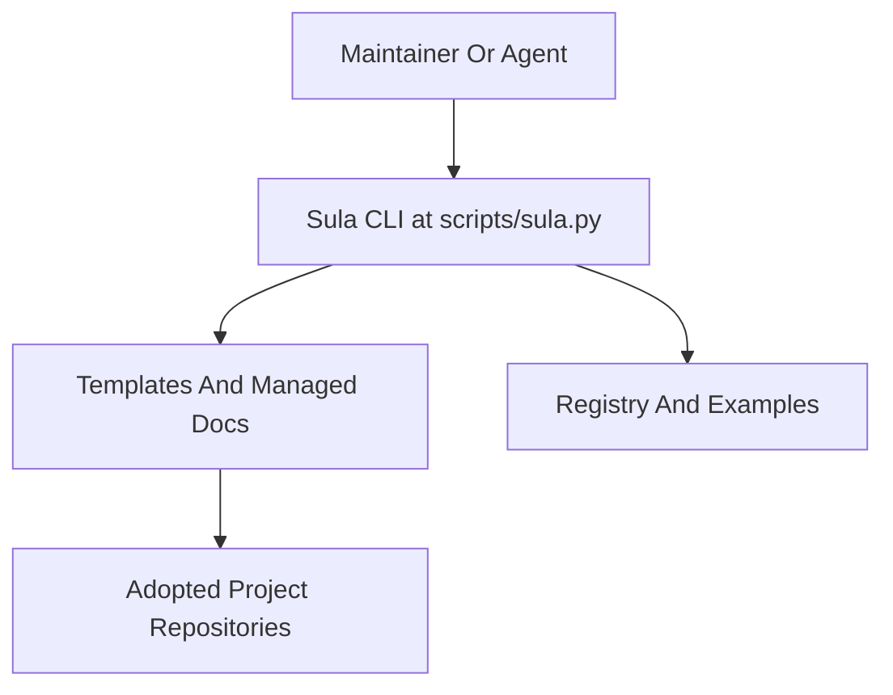

# Sula System Map

This profile assumes the repository is itself a reusable project operating system.

## System Boundary

- operating stack: Python 3 + Markdown + TOML + template-driven repository automation
- persistence and rollout metadata: GitHub repository state + local filesystem artifacts
- highest rule: `Preserve the split between centrally managed operating-system files and project-owned business truth.`

## Runtime Structure

## Key Flow Rules

- orchestration entry: [scripts/sula.py](../../scripts/sula.py)
- rollout state: [registry/adopted-projects.toml](../../registry/adopted-projects.toml)
- operator-facing overview: [README.md](../../README.md)
- release workflow reference: `.github/workflows/ci.yml`

## Invariants

1. Sula remains a reusable operating system, not a business product.
2. Managed templates must stay portable across adopted projects.
3. Example projects may validate behavior, but they do not become the source of truth for Sula Core.
