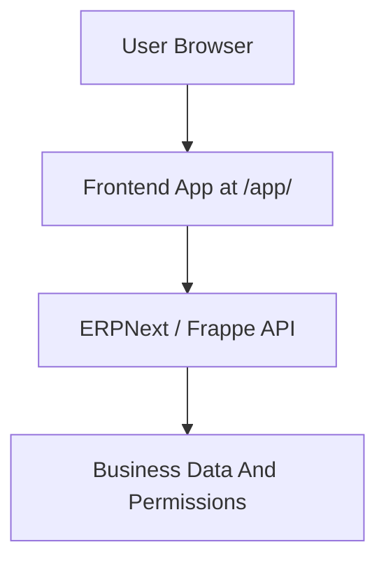

# OKOKTOTO v5 System Map

This profile assumes a React frontend that orchestrates ERPNext / Frappe capabilities.

## System Boundary

- frontend stack: React 19 + TypeScript + Vite 8 + Tailwind CSS 4 + Zustand 5 + ECharts 6
- backend/system of record: ERPNext / Frappe v15
- highest rule: `frontend-only orchestration over ERPNext-native capabilities`

## Runtime Structure

## Key Flow Rules

### Authentication And Session

- browser session is expected to use cookie auth + CSRF semantics
- session expiry codes: `401, 440`
- permission-denied codes: `403`

### Integration Layer

- primary integration lane is [src/api/erpnext.ts](../../src/api/erpnext.ts)
- app shell entry is [src/App.tsx](../../src/App.tsx)
- state layer entry is [src/store/useStore.ts](../../src/store/useStore.ts)

### Deployment

- base path: `/app/`
- primary deployment URL: `https://chn.okoktoto.com/app/`
- workflow reference: `.github/workflows/deploy-okoktoto-v5.yml`

## Invariants

1. ERPNext remains the system of record.
2. Business integration logic stays centralized.
3. Frontend routing and state choices must stay aligned with local project rules.
